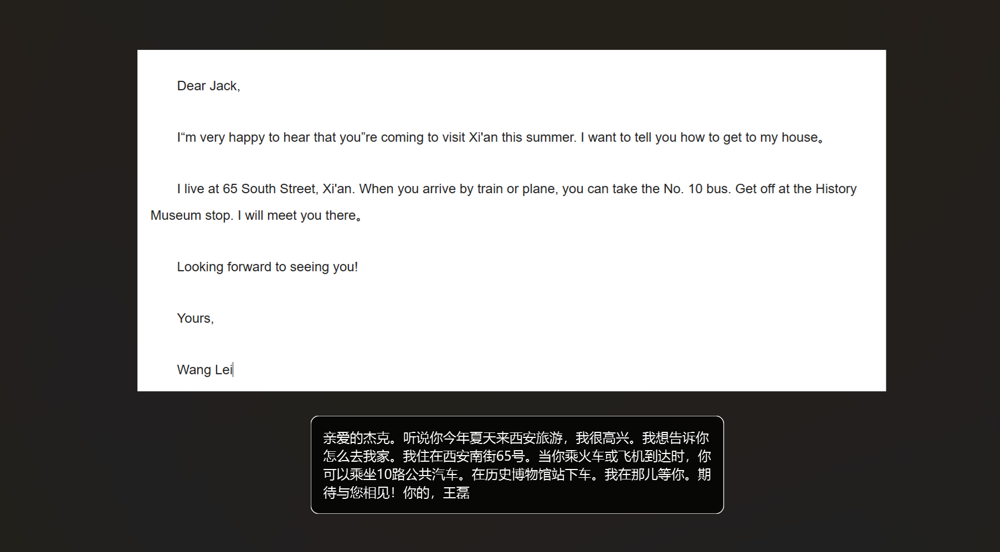
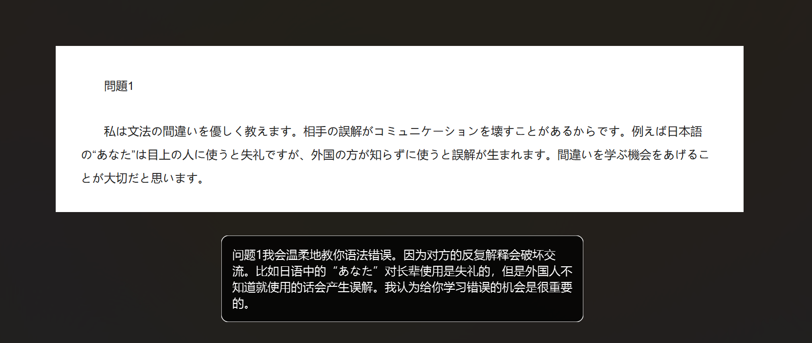
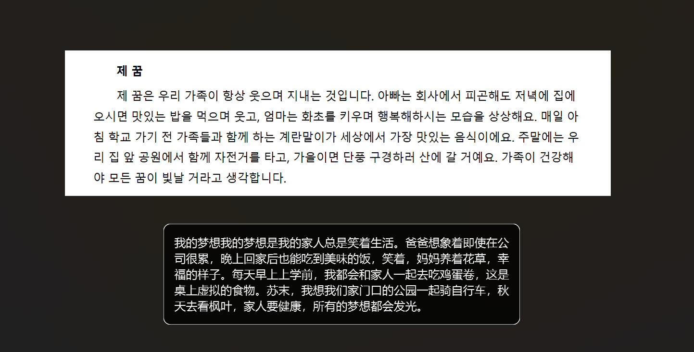

# GameTextTranslator

> 游戏内文本翻译工具

[](LICENSE)
[](https://www.qt.io/)
[]()

---

## 简介

打亚服老是被骂，但是被骂了又不知道啥意思，甚至无法反击，基于这些恼火的问题，写了这个小工具，全程vibecoding，感谢deepseek

**核心流程：** 截图 → OCR 识别 → 自动翻译 → 悬浮窗显示

---

## 截图

> 
>
> 
>
> 

---

## 快速开始

### 下载

从 [Releases](https://github.com/duanjf-code/GameTextTranslator/releases) 下载最新版本。

### 安装

1. 解压压缩包到任意目录
2. 运行 `GameTextTranslator.exe`

### 使用

1. 启动程序（后台运行，在系统托盘中显示图标）
2. 右键托盘图标 → 配置 → 填写百度翻译 API 密钥
3. 在游戏中按下截图热键（默认 `Ctrl+Alt+T`）
4. **静态翻译模式**：鼠标拖拽选中需要翻译的文本区域，翻译结果自动显示并复制到剪贴板
5. **自动监听模式：** 右键托盘图标开启后，拖拽框选游戏聊天框区域，程序会自动监控该区域文字变化并实时翻译，所有记录可在「自动监听记录」中查看。

---

##  配置说明

### 百度翻译 API 申请

1. 访问 [百度翻译开放平台](https://fanyi-api.baidu.com/)
2. 注册/登录 → 开通「通用翻译」服务
3. 获取 `APP ID` 和 `密钥`
4. 在软件「配置」界面中填写

> 免费版每月 100 万字符，个人使用完全够用。

### 配置文件

配置界面支持「保存」「另存为」「加载」功能，用户可以：

- 将配置保存到任意路径的 JSON 文件
- 加载之前保存的配置文件
- 管理多套配置（如不同游戏使用不同热键/语言）

---

## 项目结构

```text
GameTextTranslator/
├── src/
│   ├── main.cpp                 # 程序入口
│   ├── GlobalHotkey.cpp/h       # 全局热键监听
│   ├── ScreenCapture.cpp/h      # 屏幕截图
│   ├── SelectionOverlay.cpp/h   # 选区遮罩
│   ├── ResultOverlay.cpp/h      # 结果悬浮窗
│   ├── Translator.cpp/h         # 翻译引擎
│   ├── ConfigManager.cpp/h      # 配置管理
│   ├── PaddleOcrEngine.cpp/h    # OCR引擎
│   ├── SettingsDialog.cpp/h     # 配置界面
│   └── HistoryWindow.cpp/h      # 历史记录
├── CMakeLists.txt
├── LICENSE
└── README.md
```

## TODO

感觉todo有好多，但是先粗糙的端上来一个，后面慢慢完善吧，这里就不写了

------

## 贡献

欢迎 Issue 和 Pull Request！

------

## 致谢

[PaddleOCR-json](https://github.com/hiroi-sora/PaddleOCR-json) - OCR 引擎

[Qt](https://www.qt.io/) - GUI 框架

[百度翻译开放平台](https://fanyi-api.baidu.com/) - 翻译 API

------

⭐ 如果这个项目对你有帮助，请给我点一个Star！非常感谢